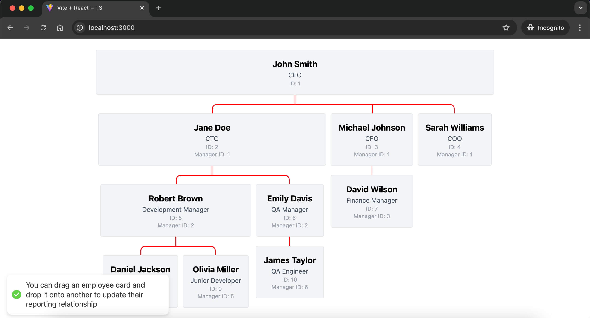

# Tech Startup Employee Tree

## Table of Contents

- [Project Overview](#project-overview)
- [How to Run the App](#how-to-run-the-app)
- [Screenshot](#screenshot)
- [Demo Videos](#demo-videos)
- [Technical Choices](#technical-choices)
- [Time Log](#time-log)

## Project Overview

A fullstack web application built using FastAPI and React to display an tech startup employee hierarchy in a drag-and-droppable tree format.

## How to Run the App

To run the app locally, follow these steps:

1. Clone the repository:

    ```bash
    git clone <repository-url>
    cd <repository-folder>
    ```

2. Ensure Docker is installed and running on your system.

3. In the root directory, use Docker Compose to build and start the services:

    ```bash
    docker-compose up
    ```

4. Access the application and API documentation:
    - [Frontend App](http://localhost:3000)
    - [Backend API Docs | Swagger UI](http://localhost:8000/docs)

## Screenshot



## Demo Videos

Watch the demo videos for a walkthrough of the application:

- [Demo Video](https://drive.google.com/file/d/1uYzPTVfmuK5GsJBjJ-kw5_LDpCg7wrSI/view?usp=sharing)

## Technical Choices

- I used React TS + Vite because it's fast and type safe.
- I used TanStack Query for state management and data fetching because it's very simple and the API is very clean.
- I used Tailwind CSS for styling because it wanted to get the project done fast. Also I love Tailwind CSS. It's very easy to use.
- For the backend I decided to place everything in one file for simplicity because the project scope is small. Also because I want to get it done fast and move to the next task.
- For the database I decided to use SQLite because I am more familiar with SQLite than with CSV file.
- I used Claude for my AI assistant because I think it's the best for coding and programming.

## Time Log

22:30 - Set up the frontend using Vite + React TS + Tailwind CSS + TanStack Query using mock data. I have built a similar app in the past so I knew exactly what libraries that I need to use in order to get it done fast.

22:45 - Added some components and got 80% of the main functionality done (without the update functionality) using mock data.

23:20 - Set up the backend. I never used FastAPI before because I mainly use Nest.js in most of my projects. Fortunately I managed to get the API working with only 2 Claude prompts. So I only needed to update a few lines of code and managed to get all the endpoints done in one fell swoop.

23:35 - Frontend and backend integration. Because the frontend is almost done using a mock data, I only need to write a few lines of code to connect it to the backend to make it fully functional.

23:42 - Set up docker-compose. I have built a bunch of apps using docker-compose before so I just needed to copy and paste some code.

00:04 - Created a documentation. I also have a template README file that I can reuse from my previous projects. So I just need to write the "Technical Choices" and "Time Log" section

00:13 - Project done. Created a new GitHub repository.
